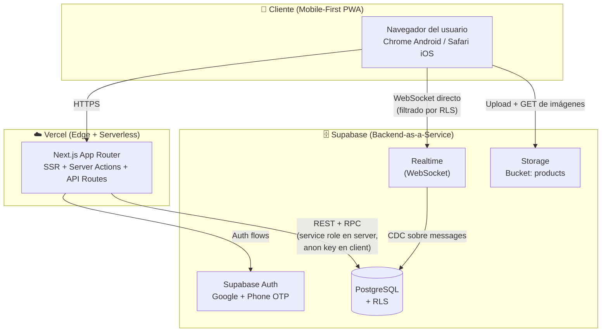
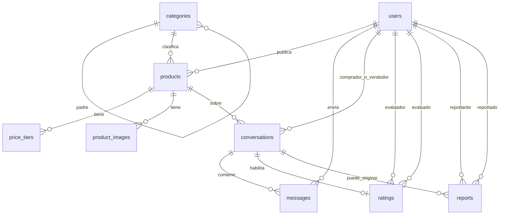

# Blueprint — Punto de Venta Agricultura

> **Documento autocontenido para ejecución por Codex (o cualquier agente).**
> Generado por El Arquitecto — Fase 4 del flujo Grill-Me.
> Fecha: 2026-05-04
> Estado: Listo para ejecución TDD.
> Idioma del proyecto y del código UX: **español (Chile)**.
> Idioma del código (identificadores, ramas, commits): **inglés**.

---

## Tabla de Contenidos

1. [Resumen del Proyecto](#1-resumen-del-proyecto)
2. [Personas y Casos de Uso](#2-personas-y-casos-de-uso)
3. [Alcance del MVP](#3-alcance-del-mvp)
4. [Tech Stack con Rationale](#4-tech-stack-con-rationale)
5. [Arquitectura](#5-arquitectura)
6. [Modelo de Datos](#6-modelo-de-datos)
7. [Seguridad: Row Level Security (RLS)](#7-seguridad-row-level-security-rls)
8. [Autenticación](#8-autenticación)
9. [Storage de Imágenes](#9-storage-de-imágenes)
10. [Estructura de Carpetas del Repo](#10-estructura-de-carpetas-del-repo)
11. [Variables de Entorno](#11-variables-de-entorno)
12. [Rutas y Páginas](#12-rutas-y-páginas)
13. [Componentes UI Reutilizables](#13-componentes-ui-reutilizables)
14. [Flujos Principales (Step-by-Step)](#14-flujos-principales-step-by-step)
15. [CONTEXT.md — Lenguaje Compartido](#15-contextmd--lenguaje-compartido)
16. [Architecture Decision Records (ADRs)](#16-architecture-decision-records-adrs)
17. [Build Order — Plan de Ejecución TDD](#17-build-order--plan-de-ejecución-tdd)
18. [Estrategia de Testing](#18-estrategia-de-testing)
19. [Criterios de Éxito Verificables](#19-criterios-de-éxito-verificables)
20. [Reglas para el Ejecutor (Qué NO Hacer)](#20-reglas-para-el-ejecutor-qué-no-hacer)
21. [Features para v2 (Fuera de Alcance)](#21-features-para-v2-fuera-de-alcance)

---

## 1. Resumen del Proyecto

**Punto de Venta Agricultura** es un *marketplace* web *mobile-first* que conecta directamente a agricultores pequeños y medianos de Chile con compradores finales (consumidores, restaurantes, ferias y locales), eliminando los 3-4 intermediarios actuales que encarecen el producto desde el campo al consumidor. La plataforma opera como un **Facebook Marketplace para productos agrícolas**: facilita la conexión, persiste el catálogo y los chats como registro informal del trato, pero **no procesa pagos ni gestiona logística** — comprador y vendedor acuerdan precio final, retiro y entrega por chat *in-app*. El MVP se lanza en **La Serena / Coquimbo (Región de Coquimbo, Chile)** y debe estar listo para escalar a todo Chile sin reescritura. Es 100% gratuito en MVP — la monetización se decide después con datos reales.

---

## 2. Personas y Casos de Uso

### 2.1 Persona Principal — Vendedor (Agricultor)

- **Quién:** Don Luis, 62 años, agricultor mediano en Vicuña. Tiene smartphone (Android gama media), conexión 4G intermitente, **no es nativo digital**.
- **Lo que necesita:** Subir una foto de su producto, escribir el precio en kilos, recibir mensajes y responderlos. Punto.
- **Restricción de UX:** Pantallas con **botones grandes**, **textos cortos**, **flujos de máximo 3 pasos**. Si Don Luis no puede publicar un producto en menos de 2 minutos sin ayuda, el sistema falla.
- **Caso de uso típico:** Subir 50kg de tomate con tramos de descuento, recibir 3 mensajes durante el día, responder y acordar retiro con uno.

### 2.2 Persona Secundaria — Comprador

- **Quién:** Tres tipos:
  - **Consumidor final** (familia que cocina en casa).
  - **Restaurante / cocina** (chef, comprador de insumos).
  - **Feria / local** (revendedor en mercado local).
- **Lo que necesita:** Buscar producto por categoría o ubicación, ver precio por volumen, contactar vendedor, valorar al cierre.
- **Caso de uso típico:** Restaurante busca "tomate", filtra por La Serena, compara 3 publicaciones, abre chat con la mejor valorada, acuerda 30kg semanales.

### 2.3 Persona Terciaria — Administrador

- **Quién:** Los 2 fundadores. No hay equipo de moderación.
- **Lo que necesita:** Ver lista de reportes pendientes, leer la conversación reportada, suspender cuenta si corresponde.
- **Caso de uso típico:** Revisa la cola de reportes una vez al día.

---

## 3. Alcance del MVP

### 3.1 Incluido

| Feature | Descripción |
|---------|-------------|
| Auth dual | Login con **Google OAuth** o **OTP por SMS** (Phone Auth). |
| Perfil flexible | Nombre + (opcional) nombre de negocio + teléfono + comuna + avatar. |
| Publicación de productos | Foto(s), título, descripción, categoría, unidad de medida, stock, ubicación, **tramos de precio escalonados**. |
| Catálogo público | Búsqueda y filtros (categoría, comuna, valoración mínima). |
| Detalle de producto | Galería, descripción, tramos de precio, perfil del vendedor, botón "Contactar". |
| Chat 1 a 1 vinculado a producto | Real-time, persistente. Una conversación por par (comprador, vendedor, producto). |
| Valoración bidireccional | 1-5 estrellas + comentario opcional. Solo después de existir conversación. |
| Reportes | Cualquiera de las dos partes puede reportar a la otra desde el chat. |
| Panel Admin | Lista de reportes, ver conversación reportada, suspender usuario. |
| PWA instalable | `manifest.json` + service worker básico. Sin push. |
| Disclaimer legal | Banner en chat: "La plataforma facilita el contacto pero no se hace responsable de la transacción." |

### 3.2 Explícitamente Excluido del MVP

- ❌ Pagos integrados (Transbank, Khipu, transferencia, Stripe, etc.).
- ❌ Pagos anticipados / reservas / *escrow*.
- ❌ Contratos con firma digital avanzada.
- ❌ Notificaciones *push* (web push API).
- ❌ Operador logístico como tercer actor.
- ❌ Internacionalización / multi-país.
- ❌ App nativa (iOS/Android) — solo web PWA.
- ❌ Sistema de cupones, descuentos cruzados o destacados pagados.

---

## 4. Tech Stack con Rationale

| Capa | Tecnología | Versión objetivo | Rationale |
|------|-----------|------------------|-----------|
| **Framework Web** | Next.js (App Router) | 14.x o 15.x | SSR para SEO de productos (Don Luis necesita que su tomate aparezca en Google), API routes integradas, *mobile-first*, fuerte ecosistema. |
| **Lenguaje** | TypeScript | 5.x estricto | El fundador viene de Java en banca — tipo estático es no negociable; reduce bugs en *forms* críticos como tramos de precio. |
| **UI** | React + Tailwind CSS + shadcn/ui | Tailwind 3.x, shadcn last | Tailwind = velocidad y consistencia mobile-first; shadcn = componentes accesibles sin lock-in (es código copiado, no dependencia). |
| **Auth** | Supabase Auth | última | Google OAuth y Phone OTP listos sin escribir backend de auth. RLS lo aprovecha de forma nativa. |
| **Base de Datos** | Supabase (PostgreSQL 15+) | gestionado | Postgres real (no NoSQL exótico), RLS para *multi-tenant* sin código aplicativo, *triggers* para `updated_at`, full-text search nativo. |
| **Real-time (Chat)** | Supabase Realtime | última | El chat se suscribe a `INSERT` en `messages` con filtro por `conversation_id`. Cero servicio externo adicional. |
| **Storage (Imágenes)** | Supabase Storage | última | *Bucket* `products` con políticas RLS por *owner*. CDN de Supabase + transformaciones de imagen. |
| **Hosting** | Vercel | gratuito al inicio | Par natural de Next.js, *preview deployments* automáticos por PR, edge network global, tier gratuito alcanza para MVP. |
| **PWA** | `next-pwa` o equivalente App Router | última compatible | Permite "instalar" la web en el celular de Don Luis sin tienda de apps. Service worker mínimo (sin push en MVP). |
| **Validación** | Zod | 3.x | Esquemas compartidos entre cliente, *server actions* y API routes. Mensajes en español a partir de `zod-i18n` o mapping manual. |
| **Forms** | React Hook Form + Zod resolver | última | Mejor *performance* en formularios largos (publicar producto con N tramos de precio), validación tipo-segura. |
| **Tests Unitarios / Componentes** | Vitest + Testing Library | última | Rápido, compatible Next 14+, sintaxis Jest. |
| **Tests E2E** | Playwright | última | El flujo crítico (publicar → contactar → valorar) se cubre con E2E. |
| **Linter / Formatter** | ESLint + Prettier | configs Next | Estándar; nada exótico. |
| **CI** | GitHub Actions | — | Lint + typecheck + tests en cada PR. Bloquea *merge* si rojo. |

### 4.1 Tecnologías Descartadas (Para que el ejecutor no las "introduzca")

- **Firebase / Firestore** → descartado, NoSQL no encaja con el modelo relacional de tramos de precio y conversaciones.
- **Prisma** → opcional pero **no requerido**: Supabase JS Client + tipos generados (`supabase gen types`) cubren el caso. Si el ejecutor quiere Prisma, debe documentar por qué; por defecto: **NO usar Prisma**.
- **Redux / Zustand** → no necesario para el MVP. Estado del servidor con React Query (o el cache de Next/Server Components); estado de UI local con `useState`.
- **MongoDB / DynamoDB** → no.
- **App nativa con React Native / Expo** → no en MVP.

---

## 5. Arquitectura

### 5.1 Diagrama de Alto Nivel



### 5.2 Principios Arquitectónicos

1. **El cliente NO tiene el `service_role` key**. Solo el `anon key`. Todo lo privilegiado pasa por *Server Components*, *Server Actions* o *Route Handlers*.
2. **Seguridad en la base de datos, no en la aplicación**. Las reglas de quién puede leer/escribir qué viven en políticas RLS de Postgres. La capa de aplicación *asume* que la DB rechaza lo no autorizado.
3. **Mobile-first absoluto**. Cualquier *layout* se diseña primero a 360px de ancho. *Desktop* es un *enhancement*, no la referencia.
4. **El chat usa WebSocket directo del cliente a Supabase Realtime**. Next.js no proxea esa conexión.
5. **Las imágenes se sirven directo desde el CDN de Supabase Storage**, no se proxean por Next.

---

## 6. Modelo de Datos

### 6.1 Diagrama Entidad-Relación



### 6.2 Esquema SQL (Postgres / Supabase)

> **Nota para el ejecutor:** Este SQL es la **fuente de verdad** del modelo. Cada migración debe partir de aquí. Tipos en inglés en código, etiquetas/UI en español. Toda tabla incluye `created_at` y, donde aplique, `updated_at` con *trigger*.

```sql
-- =======================
-- Extensiones
-- =======================
create extension if not exists "uuid-ossp";
create extension if not exists "pg_trgm"; -- para búsqueda fuzzy en títulos

-- =======================
-- ENUMs
-- =======================
create type user_role as enum ('seller', 'buyer', 'admin');
-- En MVP un usuario puede ser ambos (seller y buyer); usamos el rol como
-- tag dominante. Para simplicidad en RLS, NO restringimos publicar por rol:
-- cualquier usuario autenticado puede publicar y comprar.

create type product_status as enum ('active', 'paused', 'deleted');
create type measure_unit as enum ('kg', 'unit', 'box', 'bag', 'liter');
create type conversation_status as enum ('open', 'closed');
create type report_status as enum ('pending', 'reviewing', 'resolved', 'dismissed');

-- =======================
-- users (extiende auth.users)
-- =======================
create table public.users (
  id uuid primary key references auth.users(id) on delete cascade,
  full_name text not null,
  business_name text,                   -- opcional
  phone text,                            -- normalizado E.164
  comuna text not null,                  -- comuna de Chile
  avatar_url text,
  role user_role not null default 'buyer',
  is_suspended boolean not null default false,
  suspended_reason text,
  created_at timestamptz not null default now(),
  updated_at timestamptz not null default now()
);

-- =======================
-- categories (árbol jerárquico)
-- =======================
create table public.categories (
  id uuid primary key default uuid_generate_v4(),
  name text not null,
  slug text not null unique,
  parent_id uuid references public.categories(id) on delete restrict,
  sort_order int not null default 0,
  created_at timestamptz not null default now()
);
create index on public.categories(parent_id);

-- =======================
-- products
-- =======================
create table public.products (
  id uuid primary key default uuid_generate_v4(),
  seller_id uuid not null references public.users(id) on delete cascade,
  category_id uuid not null references public.categories(id) on delete restrict,
  title text not null,
  description text,
  measure_unit measure_unit not null,
  stock numeric(12, 2) not null check (stock >= 0),
  comuna text not null,           -- denormalizado para filtros rápidos
  status product_status not null default 'active',
  search_vector tsvector,         -- generado por trigger
  created_at timestamptz not null default now(),
  updated_at timestamptz not null default now()
);
create index on public.products(seller_id);
create index on public.products(category_id);
create index on public.products(status);
create index on public.products using gin(search_vector);

-- =======================
-- product_images
-- =======================
create table public.product_images (
  id uuid primary key default uuid_generate_v4(),
  product_id uuid not null references public.products(id) on delete cascade,
  storage_path text not null,        -- ruta en bucket 'products'
  sort_order int not null default 0,
  created_at timestamptz not null default now()
);
create index on public.product_images(product_id);

-- =======================
-- price_tiers (tramos de precio escalonados)
-- =======================
create table public.price_tiers (
  id uuid primary key default uuid_generate_v4(),
  product_id uuid not null references public.products(id) on delete cascade,
  min_quantity numeric(12, 2) not null check (min_quantity >= 0),
  price_per_unit numeric(12, 2) not null check (price_per_unit > 0),
  created_at timestamptz not null default now(),
  unique(product_id, min_quantity)
);
create index on public.price_tiers(product_id);
-- Regla aplicativa (a validar en Server Action): cada producto debe tener
-- al menos UN tramo. El primer tramo es típicamente min_quantity = 0.

-- =======================
-- conversations (1 por par comprador/vendedor/producto)
-- =======================
create table public.conversations (
  id uuid primary key default uuid_generate_v4(),
  product_id uuid not null references public.products(id) on delete cascade,
  buyer_id uuid not null references public.users(id) on delete cascade,
  seller_id uuid not null references public.users(id) on delete cascade,
  status conversation_status not null default 'open',
  last_message_at timestamptz,
  created_at timestamptz not null default now(),
  unique(product_id, buyer_id),     -- un mismo comprador no abre dos chats sobre el mismo producto
  check (buyer_id <> seller_id)     -- no se puede chatear consigo mismo
);
create index on public.conversations(buyer_id);
create index on public.conversations(seller_id);
create index on public.conversations(last_message_at desc);

-- =======================
-- messages
-- =======================
create table public.messages (
  id uuid primary key default uuid_generate_v4(),
  conversation_id uuid not null references public.conversations(id) on delete cascade,
  sender_id uuid not null references public.users(id) on delete cascade,
  content text not null check (length(content) between 1 and 2000),
  read_at timestamptz,
  created_at timestamptz not null default now()
);
create index on public.messages(conversation_id, created_at);

-- =======================
-- ratings
-- =======================
create table public.ratings (
  id uuid primary key default uuid_generate_v4(),
  rater_id uuid not null references public.users(id) on delete cascade,
  rated_id uuid not null references public.users(id) on delete cascade,
  conversation_id uuid not null references public.conversations(id) on delete cascade,
  score smallint not null check (score between 1 and 5),
  comment text,
  created_at timestamptz not null default now(),
  unique(rater_id, conversation_id), -- un rater valora una vez por conversación
  check (rater_id <> rated_id)
);
create index on public.ratings(rated_id);

-- =======================
-- reports
-- =======================
create table public.reports (
  id uuid primary key default uuid_generate_v4(),
  reporter_id uuid not null references public.users(id) on delete cascade,
  reported_id uuid not null references public.users(id) on delete cascade,
  conversation_id uuid references public.conversations(id) on delete set null,
  reason text not null,
  status report_status not null default 'pending',
  admin_notes text,
  resolved_by uuid references public.users(id),
  resolved_at timestamptz,
  created_at timestamptz not null default now(),
  check (reporter_id <> reported_id)
);
create index on public.reports(status);
create index on public.reports(reported_id);

-- =======================
-- Triggers de updated_at y search_vector
-- =======================
create or replace function public.touch_updated_at()
returns trigger as $$
begin new.updated_at = now(); return new; end;
$$ language plpgsql;

create trigger trg_users_updated_at
  before update on public.users
  for each row execute function public.touch_updated_at();

create trigger trg_products_updated_at
  before update on public.products
  for each row execute function public.touch_updated_at();

create or replace function public.products_refresh_search_vector()
returns trigger as $$
begin
  new.search_vector :=
    setweight(to_tsvector('spanish', coalesce(new.title, '')), 'A') ||
    setweight(to_tsvector('spanish', coalesce(new.description, '')), 'B');
  return new;
end;
$$ language plpgsql;

create trigger trg_products_search_vector
  before insert or update of title, description on public.products
  for each row execute function public.products_refresh_search_vector();

-- =======================
-- Vista materializada / vista para rating promedio (opcional, simple en MVP)
-- =======================
create or replace view public.user_ratings_summary as
  select
    rated_id as user_id,
    count(*) as total_ratings,
    coalesce(round(avg(score)::numeric, 2), 0) as average_score
  from public.ratings
  group by rated_id;
```

### 6.3 Datos Semilla Mínimos

**Categorías iniciales** (deben existir en producción para que un vendedor pueda publicar):

```
Verduras
  ├─ Tomate
  ├─ Lechuga
  ├─ Zanahoria
  ├─ Cebolla
  └─ Papa
Frutas
  ├─ Manzana
  ├─ Pera
  ├─ Uva
  └─ Cítricos
Hierbas
  ├─ Cilantro
  └─ Perejil
Hortalizas
  ├─ Zapallo
  └─ Choclo
Legumbres
  ├─ Porotos
  └─ Lentejas
Otros
```

> El ejecutor genera un *seed script* en `supabase/seed.sql` con estas categorías y la jerarquía vía `parent_id`.

---

## 7. Seguridad: Row Level Security (RLS)

> Todas las tablas tienen RLS **habilitado** desde la migración inicial. Si el ejecutor olvida una tabla, la build falla en CI (test específico).

### 7.1 Resumen de Políticas

| Tabla | SELECT | INSERT | UPDATE | DELETE |
|-------|--------|--------|--------|--------|
| `users` | público (perfil visible) | el propio (`auth.uid() = id`) | el propio o admin | admin |
| `categories` | público | admin | admin | admin |
| `products` | público si `status='active'`, dueño ve todos los suyos | dueño autenticado | dueño o admin | admin (soft via status='deleted') |
| `product_images` | público | dueño del producto | dueño del producto | dueño del producto |
| `price_tiers` | público | dueño del producto | dueño del producto | dueño del producto |
| `conversations` | participantes (buyer o seller) o admin | comprador autenticado, no es seller | participantes (cambio de status) | admin |
| `messages` | participantes de la conversación o admin | participante de la conversación, sender = uid | sender (solo `read_at`) | admin |
| `ratings` | público | participante de la conversación, una vez | nadie (inmutable) | admin |
| `reports` | reportante o admin | participante de la conversación | admin (resuelve) | admin |

### 7.2 Helpers SQL

El ejecutor crea estas funciones `security definer` en un esquema privado, luego las usa en las políticas:

```sql
create or replace function public.is_admin()
returns boolean
language sql stable
as $$
  select exists (
    select 1 from public.users u
    where u.id = auth.uid() and u.role = 'admin'
  );
$$;

create or replace function public.is_conversation_participant(conv_id uuid)
returns boolean
language sql stable
as $$
  select exists (
    select 1 from public.conversations c
    where c.id = conv_id
      and (c.buyer_id = auth.uid() or c.seller_id = auth.uid())
  );
$$;
```

### 7.3 Ejemplo de Política (products)

```sql
alter table public.products enable row level security;

create policy "products_public_read_active"
  on public.products for select
  using (status = 'active' or seller_id = auth.uid() or public.is_admin());

create policy "products_owner_insert"
  on public.products for insert
  with check (seller_id = auth.uid());

create policy "products_owner_update"
  on public.products for update
  using (seller_id = auth.uid() or public.is_admin())
  with check (seller_id = auth.uid() or public.is_admin());

create policy "products_admin_delete"
  on public.products for delete
  using (public.is_admin());
```

> El ejecutor escribe políticas equivalentes para cada tabla, siguiendo el resumen de 7.1.

---

## 8. Autenticación

### 8.1 Métodos Habilitados

1. **Google OAuth** — vía Supabase Auth (Google Cloud Console: crear OAuth client, copiar `client_id` + `client_secret` a Supabase).
2. **Phone OTP** — vía Supabase Auth (proveedor SMS: **Twilio** en piloto Chile; el ejecutor configura desde el dashboard de Supabase).

### 8.2 Flujo Post-Registro (Onboarding)

Tras el primer login (Google o Phone), si **no existe** una fila en `public.users` para `auth.uid()`, el cliente redirige a `/onboarding`:

1. Pedir `full_name` (requerido).
2. Pedir `business_name` (opcional).
3. Pedir `comuna` (selector de comunas de la Región de Coquimbo, expandible).
4. Pedir `phone` (si vino por Google y no tiene; si vino por Phone, ya está).
5. Subir avatar (opcional).
6. Insertar fila en `users` con `role='buyer'` por defecto. El usuario puede vender sin cambiar rol.
7. Redirigir a `/dashboard`.

### 8.3 Sesiones

- Cookie HTTP-only manejada por `@supabase/ssr` (helper de Supabase para Next App Router).
- *Server Components* leen el usuario actual con `createServerClient`.
- *Client Components* usan `createBrowserClient`.

---

## 9. Storage de Imágenes

### 9.1 Buckets

| Bucket | Visibilidad | Propósito |
|--------|-------------|-----------|
| `products` | público (lectura), restringido en escritura | Fotos de los productos. |
| `avatars` | público (lectura), restringido en escritura | Avatares de usuario. |

### 9.2 Políticas Storage

- `products`: el dueño del producto (vía join con `products.seller_id`) puede `INSERT`/`DELETE` objetos cuyo `path` empiece por `<product_id>/`.
- `avatars`: el dueño puede `INSERT`/`DELETE` `<user_id>/...`.

### 9.3 Convención de Rutas

```
products/{product_id}/{uuid}.{ext}
avatars/{user_id}/{uuid}.{ext}
```

### 9.4 Procesamiento de Imágenes

- Usar **transformaciones de Supabase Storage** (`?width=800&quality=80`) — no procesar en el servidor de Next.
- Validar en cliente antes de subir: máximo **5 MB**, formatos `image/jpeg | image/png | image/webp`.
- Máximo **5 fotos** por producto en MVP.

---

## 10. Estructura de Carpetas del Repo

```
punto-venta-agricultura/
├─ app/                          # Next.js App Router
│  ├─ (public)/                  # rutas públicas sin sesión obligatoria
│  │  ├─ page.tsx                # / — landing + buscador
│  │  ├─ productos/page.tsx      # catálogo
│  │  ├─ producto/[id]/page.tsx  # detalle de producto
│  │  └─ perfil/[id]/page.tsx    # perfil público
│  ├─ (auth)/
│  │  ├─ login/page.tsx
│  │  └─ onboarding/page.tsx
│  ├─ (app)/                     # requiere sesión
│  │  ├─ dashboard/page.tsx
│  │  ├─ publicar/page.tsx       # crear producto
│  │  ├─ mis-productos/page.tsx
│  │  ├─ chat/[id]/page.tsx
│  │  └─ chat/page.tsx           # bandeja de conversaciones
│  ├─ admin/
│  │  ├─ page.tsx                # dashboard admin
│  │  ├─ reportes/page.tsx
│  │  └─ usuarios/page.tsx
│  ├─ api/                       # route handlers cuando sea estrictamente necesario
│  ├─ layout.tsx
│  └─ globals.css
├─ components/
│  ├─ ui/                        # primitives shadcn
│  ├─ product/
│  ├─ chat/
│  ├─ rating/
│  └─ admin/
├─ lib/
│  ├─ supabase/
│  │  ├─ server.ts               # createServerClient
│  │  ├─ client.ts               # createBrowserClient
│  │  └─ admin.ts                # service_role (solo en server actions específicos)
│  ├─ db/
│  │  ├─ products.ts             # queries tipadas
│  │  ├─ conversations.ts
│  │  └─ ratings.ts
│  ├─ schemas/                   # esquemas Zod compartidos
│  ├─ utils/
│  └─ constants/
├─ types/
│  └─ database.ts                # generado: supabase gen types typescript
├─ supabase/
│  ├─ migrations/                # SQL versionado
│  ├─ seed.sql                   # categorías iniciales
│  └─ config.toml
├─ tests/
│  ├─ unit/
│  ├─ component/
│  └─ e2e/                       # Playwright
├─ public/
│  ├─ icons/                     # PWA icons 192, 512
│  └─ manifest.json
├─ .github/workflows/ci.yml
├─ .env.local.example
├─ next.config.mjs
├─ tailwind.config.ts
├─ tsconfig.json
├─ package.json
└─ README.md
```

---

## 11. Variables de Entorno

`.env.local.example` (el ejecutor lo crea, **nunca** comitea `.env.local`):

```bash
# Supabase
NEXT_PUBLIC_SUPABASE_URL=https://xxxx.supabase.co
NEXT_PUBLIC_SUPABASE_ANON_KEY=eyJ...
SUPABASE_SERVICE_ROLE_KEY=eyJ...   # SOLO server, NUNCA prefijar con NEXT_PUBLIC

# App
NEXT_PUBLIC_APP_URL=http://localhost:3000
NEXT_PUBLIC_APP_NAME="Punto de Venta Agricultura"

# Sentry (opcional MVP, recomendado para producción)
SENTRY_DSN=
```

---

## 12. Rutas y Páginas

| Ruta | Tipo | Auth | Función |
|------|------|------|---------|
| `/` | Server Component | no | Landing + buscador hero. |
| `/productos` | Server Component | no | Catálogo con filtros (categoría, comuna, valoración). |
| `/producto/[id]` | Server Component | no | Detalle: galería, tramos de precio, perfil del vendedor, botón "Contactar". |
| `/perfil/[id]` | Server Component | no | Perfil público: productos activos, valoraciones recibidas. |
| `/login` | Client Component | no | Tabs: Google / Teléfono. |
| `/onboarding` | mixto | sí (sin perfil) | Completar perfil tras primer login. |
| `/dashboard` | Server Component | sí | Resumen: productos activos, conversaciones recientes, valoraciones. |
| `/publicar` | mixto | sí | Form crear producto + tramos + fotos. |
| `/mis-productos` | Server Component | sí | Listado editable. |
| `/chat` | Server Component | sí | Bandeja de conversaciones. |
| `/chat/[id]` | Client Component | sí | Chat real-time. |
| `/admin` | Server Component | sí + admin | Dashboard admin. |
| `/admin/reportes` | Server Component | sí + admin | Cola de reportes. |
| `/admin/usuarios` | Server Component | sí + admin | Lista, suspender. |

### 12.1 Middleware

`middleware.ts` en raíz: refresca cookie de sesión Supabase en cada request (patrón oficial `@supabase/ssr`). **No** mete lógica de autorización por ruta — la autorización se chequea en cada Server Component / Server Action.

---

## 13. Componentes UI Reutilizables

| Componente | Responsabilidad |
|------------|-----------------|
| `<ProductCard />` | Tarjeta con foto principal, título, primer tramo de precio, valoración promedio del vendedor, comuna. |
| `<PriceTierTable />` | Renderiza los tramos en una tabla compacta. |
| `<PriceTierEditor />` | Editor con `useFieldArray` (RHF) para añadir/quitar tramos. Validación: `min_quantity` ascendente sin duplicados. |
| `<ProductImageUploader />` | Multi-upload con preview, drag-reorder, máx 5. |
| `<CategoryPicker />` | Selector jerárquico de 2 niveles (categoría → subcategoría). |
| `<ChatThread />` | Hilo de mensajes + composer + indicador "leído". Suscripción Realtime. |
| `<RatingStars />` | Visualización + input. |
| `<RatingForm />` | Formulario al cierre de conversación. |
| `<ReportButton />` | Modal con motivo + envío. |
| `<DisclaimerBanner />` | Banner sticky en `/chat/[id]`. |
| `<AdminReportRow />` | Fila de la cola de reportes con acciones. |

> Todos los componentes son **mobile-first**, con foco en *tap targets* ≥ 44px y contraste WCAG AA.

---

## 14. Flujos Principales (Step-by-Step)

### 14.1 Publicar un Producto (Vendedor)

1. Usuario va a `/publicar` (auth requerido).
2. Selecciona **Categoría** (jerárquica). [`CategoryPicker`]
3. Escribe **Título** (3-80 chars), **Descripción** (opcional, máx 2000).
4. Selecciona **Unidad de medida**: kg / unidad / caja / saco / litro.
5. Ingresa **Stock** y **Comuna**.
6. Sube **Fotos** (1-5). [`ProductImageUploader`]
7. Define **Tramos de precio** — al menos uno; el primero suele ser `min_quantity = 0`. [`PriceTierEditor`]
8. Click "Publicar".
9. *Server Action* valida con Zod, hace `INSERT` en `products`, luego en `price_tiers` y `product_images` (transaccional vía RPC `create_product_with_relations` opcional, o secuencial con cleanup en error).
10. Redirige a `/producto/[id]`.

### 14.2 Comprar / Contactar (Comprador)

1. Comprador navega `/productos`, filtra, abre `/producto/[id]`.
2. Click "Contactar al vendedor".
3. Si no hay sesión → `/login` con `?redirect=/producto/[id]`.
4. *Server Action* `openConversation(product_id)`:
   - Si ya existe `(product_id, buyer_id=auth.uid())` → reutilizar.
   - Si no existe → crear `conversations` con `seller_id` = `products.seller_id`. Validar `buyer_id <> seller_id`.
5. Redirige a `/chat/[conversation_id]`.
6. Banner de disclaimer visible. Mensajes en tiempo real vía suscripción a `messages` filtrada por `conversation_id`.

### 14.3 Valorar al Cierre

1. En `/chat/[id]`, cualquier participante puede pulsar "Cerrar trato" → `conversations.status = 'closed'`.
2. Al estar `closed`, aparece el `<RatingForm />` para cada parte (1 vez cada uno, garantizado por `unique(rater_id, conversation_id)`).
3. La valoración es **inmutable** (no UPDATE permitido por RLS).
4. La vista `user_ratings_summary` actualiza el promedio en lectura.

### 14.4 Reportar

1. En `/chat/[id]`, botón "Reportar".
2. Modal pide motivo (texto libre, 10-500 chars).
3. *Server Action* inserta en `reports` con `status='pending'`.
4. Admin lo ve en `/admin/reportes`.

### 14.5 Admin: Resolver Reporte

1. Admin entra a `/admin/reportes`.
2. Lista ordenada por `created_at desc`, default filtro `status='pending'`.
3. Click → ve la conversación reportada (read-only).
4. Acciones: **Suspender usuario**, **Marcar resuelto**, **Descartar**.
5. Server Action escribe `users.is_suspended=true` y `reports.status='resolved'` con `resolved_by=auth.uid()`.

---

## 15. CONTEXT.md — Lenguaje Compartido

> Este glosario está además replicado en `CONTEXT.md` en la raíz del proyecto. **Ambos archivos deben mantenerse sincronizados.** El ejecutor verifica que el código use estos términos en inglés siguiendo la columna "Identificador en código".

| Término (UX/dominio) | Identificador en código | Definición |
|----------------------|-------------------------|------------|
| Vendedor | `seller` | Agricultor pequeño o mediano que publica productos. Persona mayor en muchos casos. |
| Comprador | `buyer` | Consumidor final, restaurante, feria o local. |
| Administrador | `admin` | Uno de los 2 fundadores. Modera reportes. |
| Intermediario | (no en código) | Concepto de negocio: lo que esta plataforma elimina. |
| Publicación | `product` | Producto puesto a la venta con foto, descripción, tramos. |
| Tramo de precio | `price_tier` | Descuento escalonado por volumen. |
| Conversación | `conversation` | Chat 1 a 1 entre comprador y vendedor sobre un producto. |
| Mensaje | `message` | Línea en una conversación. |
| Valoración | `rating` | Calificación 1-5 estrellas con comentario opcional. |
| Reporte | `report` | Denuncia formal contra un usuario. |
| Categoría | `category` | Clasificación jerárquica (Verduras > Tomate). |
| Comuna | `comuna` | Subdivisión administrativa chilena. **Se mantiene en español incluso en código** (es jerga local). |
| Panel Admin | `admin panel` | Interfaz `/admin/*`. |

### 15.1 Reglas de Negocio Clave (recordatorio)

1. La plataforma **no procesa pagos** — solo conecta.
2. La plataforma **no gestiona logística** — se acuerda por chat.
3. La plataforma **no se hace responsable** de transacciones — disclaimer visible en chat.
4. MVP **100% gratuito**.
5. Precios definidos por el vendedor con tramos por volumen.
6. Valoraciones y reportes son **bidireccionales**.

### 15.2 Restricciones

- **Geografía MVP:** La Serena / Coquimbo (Región de Coquimbo, Chile).
- **UX target:** persona mayor con smartphone — botones grandes, flujos cortos.
- **Idioma de UX:** español (Chile).
- **Sin push, sin pagos, sin logística** en MVP.

---

## 16. Architecture Decision Records (ADRs)

> Formato: status, context, decision, consequences. Toda decisión nueva durante la ejecución se añade aquí como ADR siguiente.

### ADR-001 — Stack: Next.js + Supabase + Vercel

- **Status:** Accepted.
- **Date:** 2026-05-04.
- **Context:** Necesitamos un MVP rápido para un *marketplace* mobile-first, con auth (Google + Phone), DB relacional (tramos de precio), real-time (chat), storage (fotos) y SEO (productos en Google). Equipo: 1 fundador con backend Java en banca y conocimiento de Next/Supabase/Vercel.
- **Decision:** Usar Next.js (App Router) + Supabase (Auth + Postgres + Realtime + Storage) + Vercel.
- **Alternatives considered:**
  - **Firebase/Firestore:** descartado por NoSQL — los tramos de precio y conversaciones son inherentemente relacionales.
  - **Stack custom (Node + Express + Postgres + Socket.io + S3 + Auth0):** descartado por costo de integración para un solo desarrollador.
  - **Convex:** prometedor pero menos maduro para auth con Phone OTP en Chile.
- **Consequences:**
  - **+** Velocidad de desarrollo, RLS robusto, real-time sin servicio adicional, *preview deployments* gratis.
  - **−** Lock-in con Supabase para Auth/Storage/Realtime — mitigable porque Postgres es portable.
  - **−** Tier gratuito tiene límites; al escalar fuera de Coquimbo habrá que pagar.

### ADR-002 — RLS como Capa Principal de Autorización

- **Status:** Accepted.
- **Date:** 2026-05-04.
- **Context:** Marketplace con múltiples *tenants* (vendedores) que comparten una DB. Hay riesgo de exposición de datos privados (chats, contactos) si la autorización vive solo en código aplicativo.
- **Decision:** Toda autorización vive en políticas RLS de Postgres. La capa de aplicación asume que la DB rechaza lo no autorizado. El cliente usa `anon key`; el `service_role` solo se usa en *server actions* puntuales y documentadas.
- **Alternatives considered:**
  - **Autorización solo en aplicación:** descartado, alto riesgo de bugs de exposición.
  - **API Gateway con políticas:** descartado, complejidad innecesaria para MVP.
- **Consequences:**
  - **+** Seguridad por defecto incluso si una *server action* tiene un bug.
  - **+** Cliente puede consultar la DB directo (Realtime) con seguridad.
  - **−** Curva de aprendizaje de RLS para el ejecutor; mitigado con tests específicos de RLS.

### ADR-003 — Sin Procesamiento de Pagos en MVP

- **Status:** Accepted.
- **Date:** 2026-05-04.
- **Context:** Procesar pagos en Chile (Transbank, Khipu) implica integración compleja, KYC, contratos, y aumenta la responsabilidad legal de la plataforma.
- **Decision:** El MVP funciona como Facebook Marketplace — la plataforma facilita el contacto y deja que las partes acuerden pago y entrega por chat. Se incluye disclaimer legal visible.
- **Alternatives considered:**
  - **Integración con Khipu** (transferencia simple): postergada a v2 cuando haya datos de uso.
- **Consequences:**
  - **+** Tiempo a mercado mucho menor.
  - **+** Sin responsabilidad legal sobre transacciones.
  - **−** Menor control sobre confianza — mitigado con valoraciones y reportes.

### ADR-004 — Real-time vía Supabase Realtime, no servicio externo

- **Status:** Accepted.
- **Date:** 2026-05-04.
- **Context:** Chat 1 a 1 vinculado a producto. No hay grupos. Volumen MVP bajo (cientos de mensajes / día).
- **Decision:** Usar Supabase Realtime con suscripción a `INSERT` en `messages` filtrada por `conversation_id`. RLS asegura que solo participantes reciban el evento.
- **Alternatives considered:** Pusher, Ably, Socket.io custom — todas descartadas por costo y complejidad.
- **Consequences:**
  - **+** Cero infra adicional.
  - **−** Si crece el volumen, hay que monitorear cuotas Realtime.

### ADR-005 — Sin Notificaciones Push en MVP

- **Status:** Accepted.
- **Date:** 2026-05-04.
- **Context:** El público objetivo (Don Luis) no es nativo digital — gestionar permisos de push y educar sobre ello tiene fricción alta. Web Push API es heterogénea entre browsers (Safari iOS limitado).
- **Decision:** En MVP, la única señal es el badge en `/chat` cuando hay mensajes sin leer y la posición del usuario en la app. Se evalúa push en v2 con datos.
- **Consequences:**
  - **+** Menos complejidad, menos permisos pedidos.
  - **−** Tiempo de respuesta del vendedor depende de que abra la PWA.

### ADR-006 — Tramos de Precio en Tabla Separada (no JSON)

- **Status:** Accepted.
- **Date:** 2026-05-04.
- **Context:** Cada producto tiene N tramos. Podrían modelarse como `jsonb` en `products` o como tabla `price_tiers`.
- **Decision:** Tabla `price_tiers` con FK a `products`. `unique(product_id, min_quantity)`.
- **Alternatives considered:** `jsonb` → descartado, dificulta validar unicidad y consultar tramo aplicable a una cantidad dada.
- **Consequences:**
  - **+** Validaciones de unicidad y rangos en DB.
  - **+** Posible feature futura "alertar si bajo de stock en tramo X" se vuelve trivial.
  - **−** Una query más al renderizar producto — mitigado con join en select.

### ADR-007 — TypeScript Estricto y Tipos Generados de Supabase

- **Status:** Accepted.
- **Date:** 2026-05-04.
- **Context:** Errores de forma de datos son la categoría #1 de bugs en marketplaces. El fundador viene de Java estricto.
- **Decision:** `tsconfig.json` con `strict: true`, `noUncheckedIndexedAccess: true`. Tipos generados con `supabase gen types typescript --linked > types/database.ts` y regenerados en cada cambio de schema (script `db:types` en `package.json` y check en CI).
- **Consequences:**
  - **+** Errores en compile-time, autocompletado.
  - **−** Más fricción al cambiar schema — aceptado.

### ADR-008 — PWA con `next-pwa` (sin push)

- **Status:** Accepted.
- **Date:** 2026-05-04.
- **Context:** Don Luis no quiere "instalar una app" desde Play Store. Una PWA instalable desde el navegador resuelve el caso.
- **Decision:** Configurar PWA mínima: `manifest.json`, iconos 192/512, service worker básico para cache estático. **Sin** push.
- **Consequences:**
  - **+** Experiencia "tipo app" sin tienda.
  - **−** Service worker mal configurado puede servir versiones cacheadas viejas — mitigado con estrategia `network-first` para HTML.

---

## 17. Build Order — Plan de Ejecución TDD

> Cada paso es una unidad atómica que termina en *commit* verde (tests + lint + typecheck). El ejecutor abre una rama `feat/<slug>` por paso y un PR. **No avanzar al paso siguiente con CI rojo.**
>
> Convención TDD para cada paso: (a) escribir test que falla, (b) implementar mínimo para pasar, (c) refactor, (d) commit. Para infra (paso 0, 1, 2) los "tests" pueden ser scripts de verificación (e.g., `supabase db lint`, query de smoke).

### Paso 0 — Bootstrap del Repo

- `npx create-next-app@latest --typescript --tailwind --app --eslint --src-dir=false`.
- Añadir Prettier, Vitest, Playwright, Zod, React Hook Form, shadcn/ui (`pnpm dlx shadcn@latest init`).
- Configurar `tsconfig` estricto.
- CI: GitHub Actions con `lint`, `typecheck`, `test:unit`, `test:e2e --workers=1`.
- **Done when:** `pnpm test`, `pnpm lint`, `pnpm typecheck` verdes localmente y en CI sobre `main`.

### Paso 1 — Conectar Supabase y Generar Tipos

- Crear proyecto Supabase (manual por usuario; el ejecutor pide credenciales y las pone en `.env.local`).
- Instalar `@supabase/supabase-js`, `@supabase/ssr`.
- Crear `lib/supabase/server.ts`, `client.ts`, `middleware.ts` siguiendo doc oficial.
- Script `db:types` en `package.json`.
- **Done when:** se puede importar `createServerClient` y un Server Component vacío hace `auth.getUser()` sin error.

### Paso 2 — Migración Inicial: Schema Completo

- Crear archivos en `supabase/migrations/0001_init.sql` con todo lo de §6.2 + §7.
- Crear `supabase/seed.sql` con categorías de §6.3.
- Aplicar con `supabase db push` (proyecto linkeado).
- Generar tipos: `pnpm db:types`.
- **Tests:** Escribir un test de smoke en Vitest que se conecta con `service_role` y hace `select count(*) from categories` (debe ser > 0).
- **Done when:** Migración aplica limpia + tipos generados + test smoke verde.

### Paso 3 — Auth: Login Google + Phone

- Habilitar Google OAuth y Phone (Twilio) en Supabase dashboard.
- Página `/login` con tabs.
- *Callback* OAuth y verificación OTP.
- Persistencia de cookie con `@supabase/ssr`.
- **Tests E2E:** flujo de login con email-magic-link como *fallback* en test (Google y Phone no son testables fácilmente — usar `signInWithOtp` con email mock en CI).
- **Done when:** `auth.getUser()` devuelve usuario tras login.

### Paso 4 — Onboarding y Perfil

- Página `/onboarding` que detecta ausencia de fila en `users` y pide datos.
- *Server Action* `completeOnboarding` que inserta en `users`.
- Página `/perfil/[id]` (público).
- **Tests:** unit del *server action* (con DB de test), componente de form, RLS de `users`.
- **Done when:** Un usuario puede registrarse, completar perfil y ver su perfil público.

### Paso 5 — Categorías

- *Server query* `getCategoryTree()` que retorna árbol de 2 niveles.
- Componente `<CategoryPicker />`.
- **Tests:** unit del query (mock o DB de test), component test del picker.
- **Done when:** Picker renderiza el árbol semilla correctamente.

### Paso 6 — Crear Producto + Imágenes + Tramos

- Página `/publicar` con form completo (RHF + Zod).
- `<PriceTierEditor />` con `useFieldArray` (mín 1 tramo, `min_quantity` ascendente, sin duplicados).
- `<ProductImageUploader />` que sube directo a Storage `products/<product_id>/...`.
- *Server Action* `createProduct(input)` — transaccional (RPC SQL `create_product_with_relations` recomendado para atomicidad).
- **Tests:**
  - Unit: validación Zod (rechaza tramos no ascendentes).
  - Integration: server action crea producto + tramos + imágenes.
  - RLS: usuario A no puede insertar producto con `seller_id = B`.
- **Done when:** Don Luis publica un tomate con 3 fotos y 3 tramos, y aparece en su `/perfil/[id]`.

### Paso 7 — Catálogo y Detalle

- `/productos` con filtros (categoría, comuna, valoración mín).
- Búsqueda por `search_vector` (`plainto_tsquery('spanish', :q)`).
- `/producto/[id]` con galería, tramos, perfil mini del vendedor, botón "Contactar".
- `<ProductCard />` reusable.
- **Tests:**
  - Component: `<ProductCard />`.
  - E2E: navegar landing → catálogo → detalle.
- **Done when:** Listar y filtrar productos funciona en mobile.

### Paso 8 — Conversaciones

- *Server Action* `openConversation(productId)`:
  - Si `auth.uid() == products.seller_id` → error.
  - `INSERT ... ON CONFLICT (product_id, buyer_id) DO NOTHING RETURNING *` o `SELECT` previo.
- Página `/chat` (bandeja) listando conversaciones del usuario, ordenadas por `last_message_at desc`.
- Página `/chat/[id]` con `<ChatThread />` (suscripción Realtime a `messages` filtrada).
- *Trigger* SQL: tras `INSERT` en `messages`, actualizar `conversations.last_message_at`.
- Banner `<DisclaimerBanner />` siempre visible.
- **Tests:**
  - Unit: server action evita auto-conversación.
  - Integration: enviar mensaje desde A → B lo recibe vía suscripción.
  - RLS: usuario C no puede leer conversación de A↔B.
- **Done when:** Comprador y vendedor intercambian 5 mensajes en tiempo real.

### Paso 9 — Cierre + Valoración

- Botón "Cerrar trato" en `/chat/[id]` → cambia `conversations.status='closed'`.
- `<RatingForm />` aparece para cada parte (comprobar `unique(rater_id, conversation_id)`).
- Vista `user_ratings_summary` integrada en `<ProductCard />` y `/perfil/[id]`.
- **Tests:**
  - Unit: rating duplicado falla.
  - RLS: rating es inmutable.
  - Component: `<RatingStars />` renderiza correcto.
- **Done when:** Tras cerrar conversación, ambas partes valoran y los promedios se reflejan en perfiles.

### Paso 10 — Reportes

- `<ReportButton />` en `/chat/[id]`.
- *Server Action* `submitReport`.
- **Tests:** unit + RLS (reportante o admin pueden ver el reporte).
- **Done when:** Reporte aparece en `reports` con `status='pending'`.

### Paso 11 — Panel Admin

- Middleware/Server check: `is_admin()` en cada Server Component bajo `/admin/*`.
- `/admin/reportes`: lista pendientes, ver conversación (read-only), acciones (suspender / resolver / descartar).
- `/admin/usuarios`: buscar usuario, suspender/reactivar.
- Cuando `is_suspended=true`, las server actions de creación rechazan; el usuario ve un banner explicativo.
- **Tests:**
  - E2E: admin suspende a un usuario y este no puede publicar.
  - RLS: no-admin no puede ver `/admin/*`.
- **Done when:** Los 2 fundadores pueden moderar.

### Paso 12 — PWA

- `next-pwa` configurado (compatible App Router, ver doc oficial — si hay incompatibilidad, usar `@ducanh2912/next-pwa` o equivalente).
- `manifest.json`, iconos 192 y 512.
- Service worker con estrategia `network-first` para HTML, `cache-first` para estáticos.
- **Tests E2E:** Lighthouse en CI debe dar PWA score ≥ 90.
- **Done when:** Instalable desde Chrome Android.

### Paso 13 — Deploy a Vercel

- Conectar repo a Vercel.
- Variables de entorno en Vercel (las mismas de §11).
- Dominio temporal `*.vercel.app` para piloto.
- **Done when:** producción accesible y *smoke E2E* pasa contra prod.

### Paso 14 — Hardening Pre-Piloto

- Sentry o equivalente para errores en producción.
- Logs de Server Actions críticas (`createProduct`, `openConversation`, `submitReport`).
- Rate limiting básico en endpoints sensibles (Vercel Middleware o `@upstash/ratelimit`).
- Política de privacidad y términos de uso (texto legal proveído por el fundador).
- Banner de disclaimer.
- **Done when:** Un usuario externo prueba el flujo completo sin caídas.

---

## 18. Estrategia de Testing

| Capa | Herramienta | Qué se cubre |
|------|-------------|--------------|
| Unit | Vitest | Esquemas Zod, utilidades puras, lógica de tramos. |
| Component | Vitest + Testing Library | Renders de `ProductCard`, `PriceTierEditor`, `ChatThread`, `RatingForm`. |
| Integration / DB | Vitest contra Supabase local | *Server actions* y políticas RLS (suite específica `tests/rls/`). |
| E2E | Playwright | Tres flujos críticos: (1) Vendedor publica, (2) Comprador contacta y chatea, (3) Admin suspende. |
| Lighthouse | Playwright + Lighthouse CI | PWA + accesibilidad ≥ 90. |

### 18.1 Política RLS

Para cada tabla, escribir un test:

```typescript
// tests/rls/products.test.ts
test('un usuario no puede leer productos en estado paused de otro', async () => {
  // create user A and B with anon clients
  // A creates product with status='paused'
  // B selects → expect empty
});
```

### 18.2 Mocks Mínimos

- **No mockear Supabase** en tests de integración → usar Supabase local (`supabase start`).
- Mocks aceptables: Twilio (durante login OTP en E2E), Google OAuth en E2E (usar email magic-link como sustituto).

---

## 19. Criterios de Éxito Verificables

El MVP se considera **listo para piloto** cuando se cumplen TODOS:

1. ✅ Don Luis (vendedor de prueba) publica un producto con foto y 3 tramos en **menos de 2 minutos** sin asistencia.
2. ✅ Un comprador encuentra el producto vía búsqueda en `/productos`, abre detalle, contacta al vendedor.
3. ✅ Vendedor y comprador intercambian al menos 5 mensajes en tiempo real (latencia < 3 s en 4G).
4. ✅ Cierran el trato y ambos se valoran. Las valoraciones aparecen en perfil y catálogo en menos de 5 s.
5. ✅ Un comprador reporta a un vendedor; el reporte aparece en `/admin/reportes`.
6. ✅ Un admin suspende al vendedor reportado; el vendedor no puede crear nuevos productos y ve banner.
7. ✅ La app pasa Lighthouse PWA score ≥ 90 en mobile.
8. ✅ Cero exposiciones de datos cruzadas: tests de RLS cubren todas las tablas y pasan en CI.
9. ✅ El cliente NO usa nunca `service_role` (verificado por test que escanea bundle).
10. ✅ Tipos de Supabase regenerados y commiteados; `pnpm typecheck` verde.
11. ✅ Lint, unit, integration y E2E verdes en CI.
12. ✅ Deploy en Vercel accesible públicamente con dominio HTTPS.

---

## 20. Reglas para el Ejecutor (Qué NO Hacer)

> Estas reglas tienen carácter de **bloqueo**. Si el ejecutor las viola, debe revertir y proponer alternativa.

1. **NO** introducir un ORM (Prisma, Drizzle, etc.) sin un ADR justificándolo. Default: Supabase JS Client + tipos generados.
2. **NO** usar el `service_role` key en código que pueda llegar al cliente. Solo en *Server Actions* / *Route Handlers* explícitamente marcados.
3. **NO** prefijar variables sensibles con `NEXT_PUBLIC_`.
4. **NO** desactivar RLS en ninguna tabla, ni siquiera "temporalmente para depurar".
5. **NO** procesar pagos, integrar Transbank/Khipu/Stripe, ni almacenar datos de tarjetas. Está fuera de alcance.
6. **NO** integrar notificaciones push, ni siquiera "como bonus".
7. **NO** reescribir UX del flujo del vendedor para "modernizarlo" — la simplicidad para Don Luis es no negociable. Cualquier flujo del vendedor con más de 3 pasos requiere ADR.
8. **NO** asumir un único `comuna` hardcodeado — aunque el piloto sea Coquimbo, la base de datos debe permitir cualquier comuna.
9. **NO** mezclar lenguaje en código: identificadores en **inglés**; copy de UI en **español de Chile**.
10. **NO** usar `any` en TypeScript salvo justificación con `// eslint-disable-next-line` y comentario explicando por qué.
11. **NO** mockear Supabase en tests de integración (usar instancia local).
12. **NO** comprimir imágenes en el servidor de Next — usar transformaciones de Supabase Storage.
13. **NO** introducir Redis / colas / cron jobs en MVP. Cuando se necesite, ADR.
14. **NO** hacer "soft deletes" en tablas distintas a `products` (donde es `status='deleted'`). El resto borra duro o no borra.
15. **NO** crear una API REST paralela "por si acaso" — Server Actions cubren el MVP.
16. **NO** asumir una resolución de pantalla mayor a 360px en *layouts*; mobile es la referencia.
17. **NO** subir secretos al repo. Si por error pasa, rotar inmediatamente y documentar incidente.
18. **NO** silenciar tests rotos. Si un test molesta, arreglar la causa raíz o eliminar el test con justificación en PR.
19. **NO** avanzar al siguiente paso del Build Order con CI rojo.
20. **NO** modificar el modelo de datos sin actualizar este blueprint y crear un ADR.

---

## 21. Features para v2 (Fuera de Alcance)

| Feature | Razón de aplazamiento |
|---------|----------------------|
| Pagos integrados (Transbank, Khipu, transferencia) | KYC + responsabilidad legal + complejidad — esperar datos de uso. |
| Pagos anticipados / *escrow* / reservas | Requiere pagos integrados primero. |
| Contratos con firma digital avanzada | Caso de borde para B2B grande, no MVP. |
| Notificaciones push (Web Push API) | UX compleja para persona mayor + heterogeneidad iOS — esperar. |
| Operador logístico como tercer actor | Modelo de negocio cambia; necesita validación. |
| Expansión geográfica a todo Chile | Validar primero en Coquimbo. |
| Monetización (suscripción / comisión / publicidad) | Decidir con datos reales. |
| App nativa (iOS/Android) | PWA cubre el caso en MVP. |
| Multilenguaje | Solo Chile. |
| Cupones / promociones cruzadas | Distorsiona el modelo simple "vendedor pone precio". |

---

## Apéndice A — Comandos Útiles

```bash
# Desarrollo
pnpm dev
pnpm build && pnpm start
pnpm lint
pnpm typecheck
pnpm test           # vitest
pnpm test:e2e       # playwright

# Supabase
supabase start                  # local
supabase db push                # aplicar migraciones a remoto linkeado
supabase db reset               # local, destructivo
pnpm db:types                   # regenerar types/database.ts

# Deploy
vercel --prod
```

## Apéndice B — Convenciones de Commit

`<type>(<scope>): <subject>` en inglés.

- `feat(products): add price tier validation`
- `fix(chat): prevent self-conversation`
- `chore(db): add unique index on conversations`
- `test(rls): cover messages select for non-participants`

## Apéndice C — Definition of Done por PR

- [ ] Branch desde `main`, nombre `feat/<slug>` o `fix/<slug>`.
- [ ] Tests añadidos y verdes.
- [ ] Lint y typecheck verdes.
- [ ] Capturas mobile (360px) en la descripción del PR si hay UI.
- [ ] Si toca schema → migración + tipos regenerados + commits separados.
- [ ] Si toca RLS → test específico de RLS añadido.
- [ ] Sin `console.log` ni `TODO` sin issue asociado.
- [ ] Cualquier desviación del blueprint → ADR nuevo en este archivo + mención en el PR.

---

**Fin del Blueprint.** Próximo paso: pasar este documento a Codex para ejecución TDD del Paso 0.
